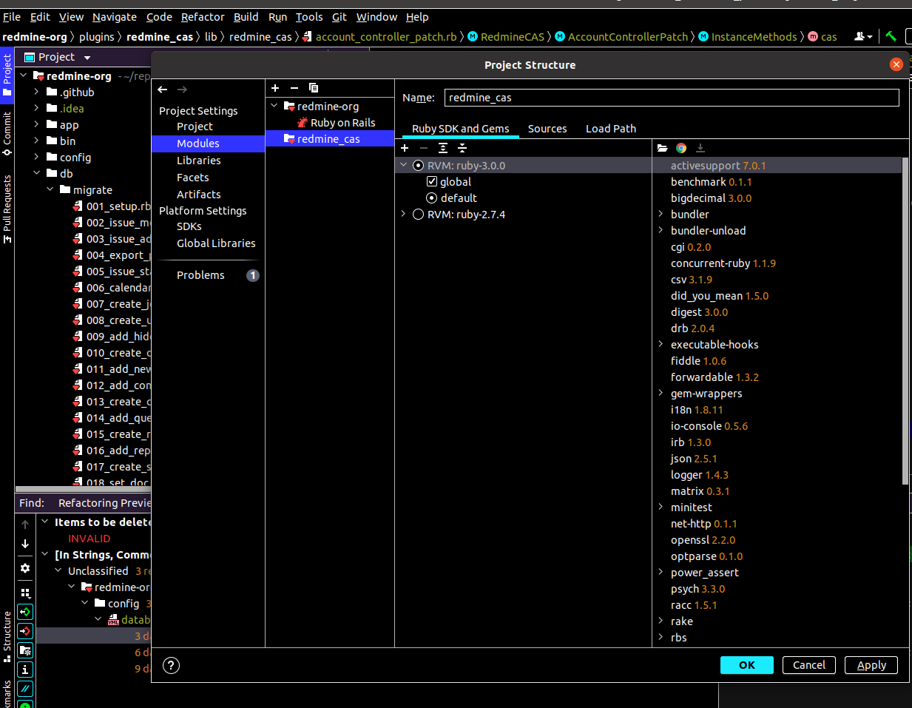

# Developing Redmine CAS plugin

# Development Environment Setup

Install ruby and builder using rvm
- `https://github.com/rvm/rvm`
Currently the development is done with ruby 2.7.4
switch version `rvm use 2.7.4`

Redmine Setup
- Checkout the redmine source code `git clone https://github.com/redmine/redmine.git`
- Checkout the currently used redmine dogu version `git checkout 4.2.3`

Prepare Plugin
- Build the plugin `gem build rubycas-client.gemspec`
- Copy the generated plugin files `target` 

Intellij Setup

1) Install the ruby plugin https://plugins.jetbrains.com/plugin/1293-ruby
2) Import redmine src code and add the module 

3) The run configuration should be imported automatically (if not see troubleshooting)

DB Setup

## Troubleshooting
### Problems with automatic run configuration setup
1) close intellij
2) go to the project source files and remove the `.idea` folder.
3) start intellij

### Problems with RVM 
With some installation methods you may encounter some missing permissions. Change the ownership of the rvm directory so bundler has access to the folders it will use for dependencies. `sudo chown [user]:[user] /usr/share/rvm`

### Intellij Error `No Ruby interpreter configured for Project` is displayed in Intellij
If you are working with Inellij and the message `No Ruby interpreter configured for Project` does not close despite correct Ruby installation and Ruby SDK configuration,
open the project settings via 'Ctrl+Alt+Shift+S' and navigate to the tab 'Modules'. There you should see a small folder with an **orange Ruby symbol**.
If instead the symbol on the folder is a small blue rectangle, Intellij tries to import the project as a Java project with JRuby content.
Reimport the module via '+' button -> 'Import Module' -> 'Create a module from existing sources' -> follow the instructions and then click on 'finish'.