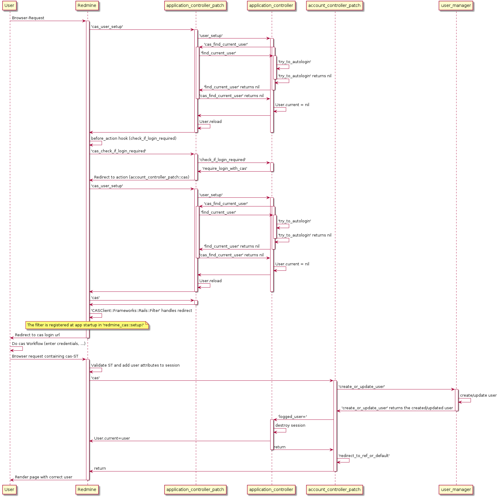

# Workflow der Funktionsaufrufe bei CAS-Zugriffen

Die folgenden Plantuml-Diagramme sollen den Ablauf der 
Funktionsaufrufe bei erfolgreichem Zugriff visualisieren.

Aufruf bei Zugriff auf die Oberfläche:

Aufruf bei Zugriff über die API:
