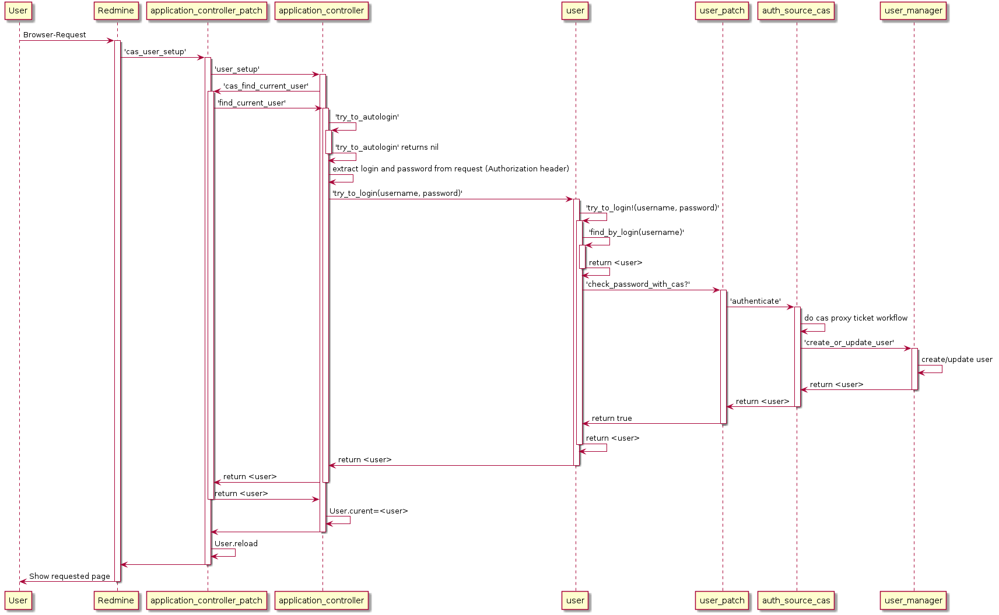

# Workflow of the function calls with CAS accesses.

The following Plantuml diagrams are intended to visualize the workflow of the
Visualize function calls on successful access.

Call on access to the interface:

Call when accessing via the API:
