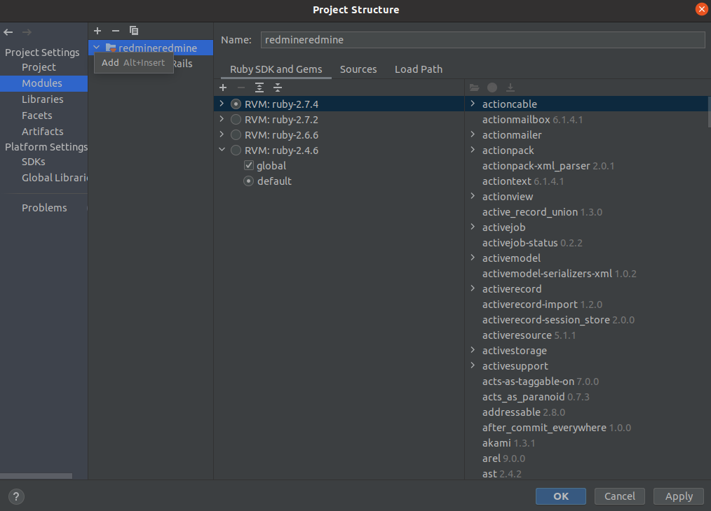

# Development of the Redmine CAS plugin

## Local setup for debugging

### Setting up EcoSystem
- Set up an EcoSystem locally with vagrant (`https://github.com/cloudogu/ecosystem`)
- Put Cas-Dogu in development mode
  - `etcdctl set config/_global/stage development`
  - `docker restart cas`

### Install Ruby and Builder with rvm
- `https://github.com/rvm/rvm`.
  Currently development is done with ruby 2.7.4
  change version `rvm use 2.7.4` (This must be done again in each terminal instance as well as in the IDE if necessary)

### prepare rubycas-client
- This is necessary to be able to use the CAS plugin in a locally set up Redmine
- Check out the Redmine source code `git clone https://github.com/cloudogu/rubycas-client.git`.
- Change with the terminal into the directory of the plugin
- Make sure that the correct ruby version is selected with `rvm use
- Build the plugin with `gem build rubycas-client.gemspec`.
- Install the plugin with `gem install rubycas-client`.

### Redmine setup
- Check out the Redmine source code `git clone https://github.com/redmine/redmine.git`
- Check out the currently used Redmine-Dogu version (e.g. `git checkout 4.2.3`)
- Build the cas-plugin in this repository with `bundle/bundle_plugin.rb`.
- Put the built cas-plugin into the `<path-to-redmine>/plugins` folder
- Create the following file as `config.database.yml`:
  `yml
  production:
  adapter: sqlite3
  database: db/redmine.sqlite3
  development:
  adapter: sqlite3
  database: db/redmine.sqlite3
  test:
  adapter: sqlite3
  database: db/redmine.sqlite3
```
- Create the following file as `config/secrets.yml`:
``yml
production:
  secret_key_base: production_secret_key

development:
  secret_key_base: static_secret_key

test:
  secret_key_base: static_test_secret_key

secret_key_base: global_key_for_all_env
```
- Change with the terminal into the directory of Redmine
- Make sure that the correct ruby-version is selected with `rvm use`.
- Install bundler with `gem install bundler`.
- Install dependencies with `bundle install`.
- Perform database migration with `RAILS_ENV=development bundle exec rake db:migrate`.
- With `rails server` you can now start Redmine locally

### Setup for debugging in the IDE (intellij)
- Open the configured Redmine in the IDE
- File -> Project Structure -> Open Modules
- If a module is created here, remove it if necessary by clicking on the minus.
- Click on the plus, then on Import Module
- Select the path from Redmine
- Next -> Next -> wait until ruby on Rails is recognized -> finish
- Select the correct Ruby version for the imported module
- It should look like this
  
- At this point run configurations should be created automatically
  - If this is not done, Intellij has initialized incorrectly
  - The best solution for this case is to check out Redmine again and start from 'Redmine setup' again
- Select and adjust the run configurations
  - Select correct ruby version
- It should look something like this:
  
- Set up configuration for local EcoSystem
- `rake redmine_cas:change_setting\[admin_group,<your-admin-group>\]`
- `rake redmine_cas:change_setting\[redmine_fqdn,192.168.56.2\]`
- `rake redmine_cas:change_setting\[cas_fqdn,192.168.56.2\]`
- `rake redmine_cas:change_setting\[cas_relative_url,/cas\]`
- `rake redmine_cas:change_setting\[enabled,1\]`
- Now Redmine can be started via the run configuration, also in debug mode


## Troubleshooting
### Problems with the automatic run configuration
1) close intellij
2) go to the project source files and remove the folder `.idea`.
3) start intellij

### Problems with RVM
Some installation methods may cause missing permissions. Change the ownership of the rvm directory so that Bundler has access to the folders it will use for dependencies. sudo chown [user]:[user] /usr/share/rvm`.
