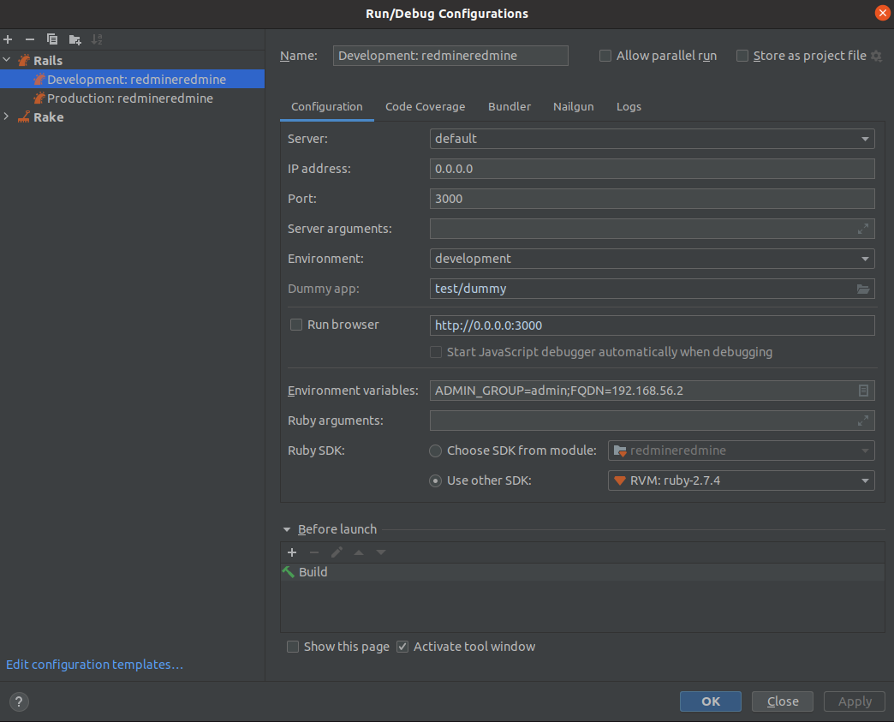

## Development of the Redmine CAS plugin

## Local setup for debugging

### Set up EcoSystem
- Set up an EcoSystem locally with vagrant (`https://github.com/cloudogu/ecosystem`)
- Set Cas-Dogu to development mode
  - `etcdctl set config/_global/stage development`
  - `docker restart cas`

### Install Ruby and Builder with rvm
- `https://github.com/rvm/rvm`.
  Currently, the development is done with Ruby 3.0.6
  Change version `rvm use 3.0.6` (This must be done again in each terminal instance and, if necessary, in the IDE)
  - it's possible to use other version managers, like [`rbenv`](https://github.com/rbenv/rbenv?tab=readme-ov-file#homebrew)

### Prepare rubycas-client
- This is necessary to be able to use the CAS plugin in a locally installed Redmine
- Check out the Redmine source code
  - `git clone https://github.com/cloudogu/rubycas-client.git`
  - Use the terminal to change to the plugin directory
    - `cd ${path/to/projects}/rubycas-client`
  - Make sure that the correct ruby version is selected with `rvm use
    - rbenv: `rbenv install --skip-existing 3.0.6 && rbenv local 3.0.6`
  - Build the plugin as a gem
    - `gem build rubycas-client.gemspec`
    - Warnings appear here, which can be ignored
    - A gem file is stored
  - Install the plugin in the system so that it is found when Redmine builds it
    - `gem install rubycas-client-2.4.0.gem`

### Collect the plugin

- Build the `redmine_cas` plugin in this repository
  - `cd bundle && ./bundle_plugin.rb`
  - a directory structure is created under `bundle`
    - this directory must be copied to Redmine later

### Redmine setup
- Check out the Redmine source code `git clone https://github.com/redmine/redmine.git`
- Check out the currently used Redmine-Dogu version (e.g. `git checkout 5.0.5`)
- Create the following file in `config/database.yml`:
```yml
production:
  adapter: sqlite3
  database: db/redmine.sqlite3
development:
  adapter: sqlite3
  database: db/redmine.sqlite3
test:
  adapter: sqlite3
  database: db/redmine.sqlite3
```
- Create the following file as `config/secrets.yml`:
```yml
production:
  secret_key_base: production_secret_key

development:
  secret_key_base: static_secret_key

test:
  secret_key_base: static_test_secret_key

secret_key_base: global_key_for_all_env
```
- Place the built cas-plugin in the `<path-to-redmine>/plugins` folder
- Change to the Redmine directory with the terminal
- Make sure that the correct ruby version is selected with `rvm use`
  - rbenv: `rbenv install 3.0.6 && rbenv local 3.0.6` seems to work
- check `config/database.yaml` and `config/secrets.yml
  - there are warnings during `bundle install` (see below) if YAML files are missing
- Copy config YAML files in the Redmine repo into the `config/` directory
- Install bundler with `gem install bundler`
- Install dependencies with `bundle install`
- Perform database migration
  - `RAILS_ENV=development bundle exec rake db:migrate`
- Install "Ruby on Rails
  - `gem install rails -v 6.1`
  - the exact version comes from the Redmine Gemfile
- With `rails server` Redmine can now be started locally

### Setup for debugging in the IDE (IntelliJ)
- Open the configured Redmine in the IDE
- File -> Project Structure -> Open Modules
- If a module has been created here, remove it by clicking on the minus sign if necessary
- Click on the plus, then on Import Module
- Select the path from Redmine
- Next -> Next -> wait briefly until Ruby on Rails is recognized -> finish
- Select the correct Ruby version for the imported module
- It should look something like this:
  
- Run configurations should have been created automatically at this point
  - If this has not been done, IntelliJ has initialized itself incorrectly
  - The best solution in this case is to check out Redmine again and start at 'Redmine setup' again
- Select and customize the run configurations
  - Select the correct ruby version
- It should look something like this:
  
- Set up configuration for local EcoSystem (executable in the redmine directory, do not forget replacements)
  ```bash
  rake redmine_cas:change_setting\[admin_group,<your-admin-group>\]
  rake redmine_cas:change_setting\[redmine_fqdn,localhost:3000\]
  rake redmine_cas:change_setting\[cas_fqdn,192.168.56.2\]
  rake redmine_cas:change_setting\[cas_relative_url,/cas\]
  rake redmine_cas:change_setting\[enabled,1\]
  ```
- Make sure that http://localhost:3000/settings?tab=authentication `Authentication required` is set to `Yes`.
- Redmine can now be started via the run configuration, even in debug mode
- Be careful: In the local Redmine the "Login" link, the login dialog must be displayed. It is logged in (by name) with the local admin, but a CAS password is used (possibly only if the Redmine local admin has the same username as the CAS admin)
- Make sure that any breakpoints are set in the Redmine repository under `plugins/redmine_cas/.../*.rb`

## Troubleshooting
### Problems with the automatic run configuration
1) Close IntelliJ
2) go to the project source files and remove the folder `.idea`.
3) start IntelliJ

### Problems with RVM
Some installation methods may result in missing permissions. Change the ownership of the rvm directory so that Bundler has access to the folders it will use for the dependencies.
`sudo chown [user]:[user] /usr/share/rvm`
